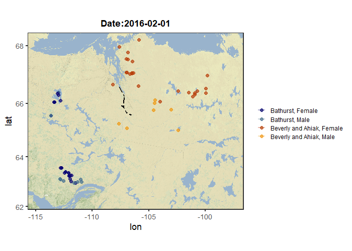

# caribou
A place for interesting code developed in the process of analyzing caribou movement data

Code for a visualization I created using a combination of {ggplot2}, {ggmap}, {gganimate}, and {sf}. It shows satellite-collared barren-ground caribou migrating to their calving grounds in the Canadian Arctic, spring 2016. Animating this data was critical because there was such a big temporal component in addition to the spatial component. So much information would be lost in a static plot - like the fact that the male caribou migrate after the females, or how the actual migration (2000+ km!!) occurs over a period of only two weeks.

